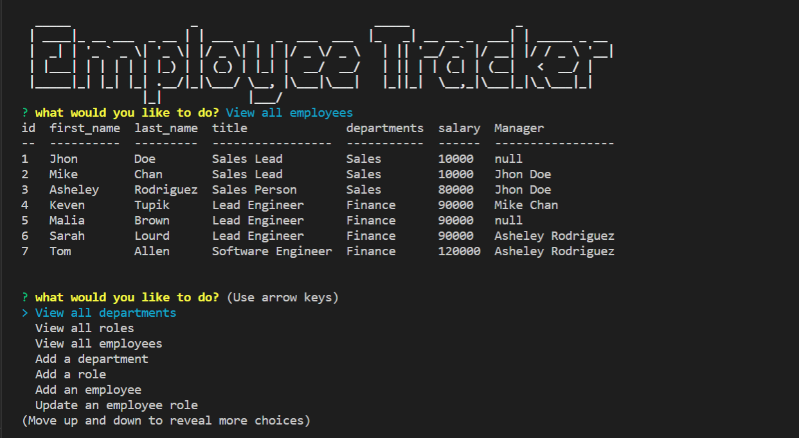

# Employee Tracker
[](https://opensource.org/licenses/Apache-2.0)
## Description

This command line application is used to manages company's employee database which enables to view and manage the departments, roles, and employees in the company so that it will be easy to organize and access data based on their catagory addition to that it helps to add and update datas based on user requirement. 
## Table of Content
* [Installation](#Installation)
* [Usage](#Usage)
* [Licence](#Licence)
* [contributing](#contributing)


## Installation
```npm install```  
## Usage
- Clone the code from the repository to local computer
- Open the terminal
- write npm install in the terminal and hit enter to install all the neccesary dependencies that this application uses
- Write npm start to run the application
- Choose whatever you want to do



 ## Licence
This Licence belongs to Apache!

## Contributing
Pull requests are welcome. For major changes, please open an issue first to discuss what you would like to change. Please make sure to update the code as appropriate.

## Questions
If you have any question about the repo, open an issue or contact me directly at [fasikaWalle](https://github.com/fasikaWalle/)

If you want to reach me for further questions please contact me through fasikabini12@gmail.com
    